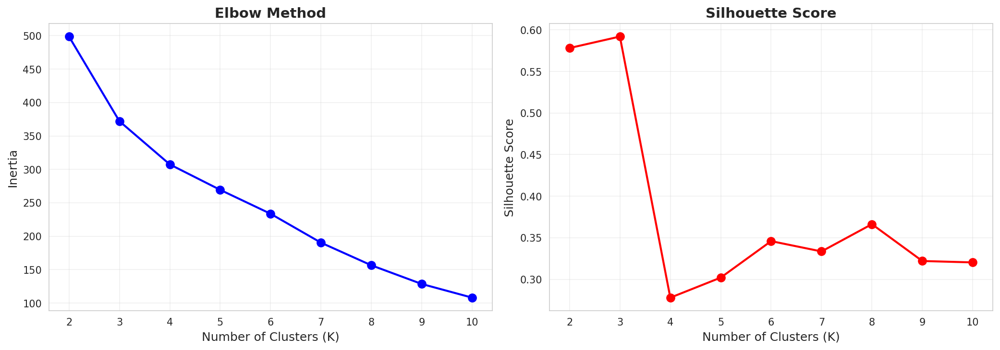
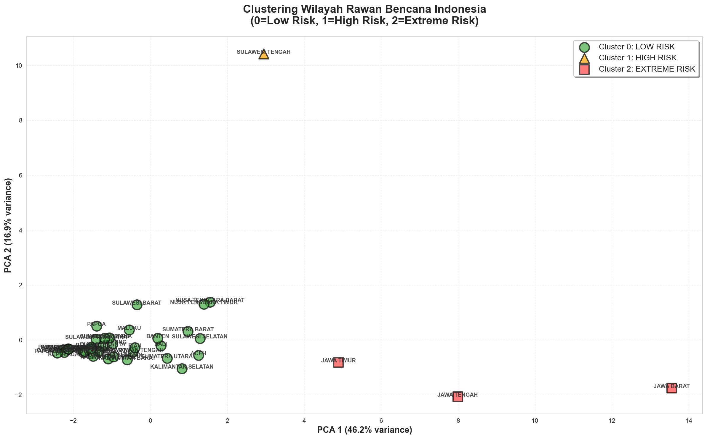
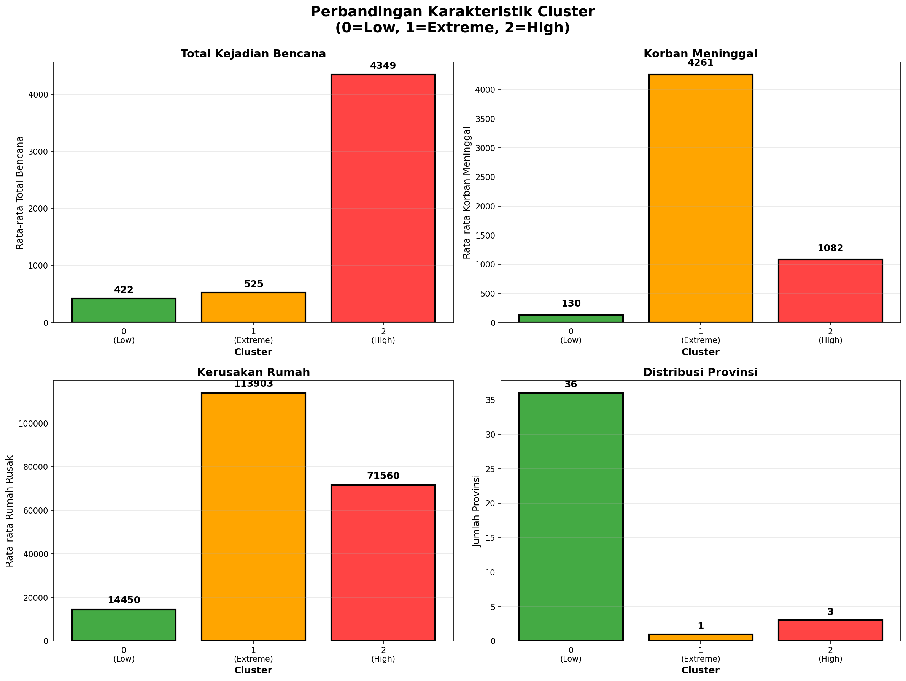
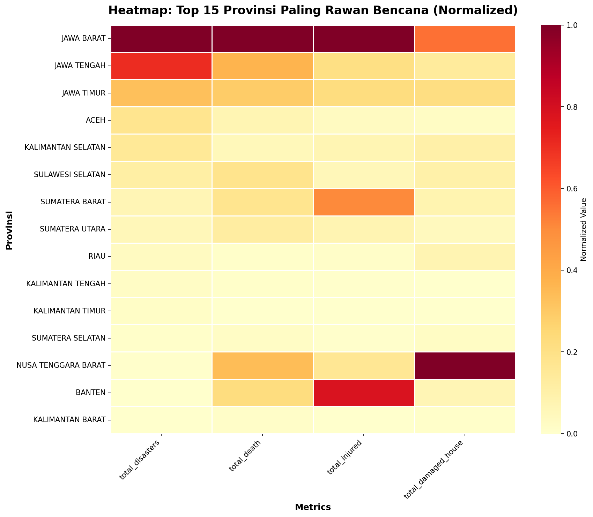

# 🍈 Clustering Wilayah Rawan Bencana Indonesia

[](https://www.python.org/)
[](https://pandas.pydata.org/)
[](https://scikit-learn.org/)
[](LICENSE)

**Project Data Mining:** Clustering provinsi di Indonesia berdasarkan pola bencana alam menggunakan K-Means Clustering.

---

## 📋 Deskripsi Project

Project ini menganalisis dataset bencana alam Indonesia (2018-2024) dari BNPB untuk:
- ✅ Mengelompokkan provinsi berdasarkan risiko bencana
- ✅ Mengidentifikasi zona risiko tinggi, menengah, dan rendah
- ✅ Memberikan rekomendasi alokasi resources dan mitigasi bencana

**Dataset:** [Indonesia Natural Disaster Dataset (BNPB Records)](https://www.kaggle.com/datasets/maudiana/indonesia-natural-disaster-dataset-bnpb-records)

---

## 🎯 Hasil Clustering

### 🟢 **Cluster 0: LOW-MODERATE RISK**
- **36 provinsi** (mayoritas Indonesia)
- Rata-rata: 422 kejadian, 130 korban meninggal
- **Rekomendasi:** Maintain readiness & strengthen local capacity

### 🟠 **Cluster 1: EXTREME RISK**
- **1 provinsi:** SULAWESI TENGAH
- Rata-rata: 525 kejadian, **4,261 korban meninggal** (tertinggi!)
- **Rekomendasi:** Prioritas #1 untuk early warning system & disaster preparedness

### 🔴 **Cluster 2: HIGH RISK**
- **3 provinsi:** JAWA BARAT, JAWA TENGAH, JAWA TIMUR
- Rata-rata: **4,349 kejadian** (tertinggi!), 1,082 korban meninggal
- **Rekomendasi:** Fokus mitigasi banjir, longsor, & infrastruktur resilient

---

## 📊 Visualisasi

### 1. Elbow Method & Silhouette Score


### 2. PCA Visualization


### 3. Cluster Comparison


### 4. Heatmap Top 15 Provinsi


---

## 🚀 Cara Menjalankan

### **1. Clone Repository**
```bash
git clone https://github.com/GuavaPopper/Clustering_Datmin.git
cd Clustering_Datmin
```

### **2. Install Dependencies**
```bash
pip install -r requirements.txt
```

### **3. Jalankan Python Script**
```bash
python clustering_bencana.py
```

### **4. Atau Buka Jupyter Notebook**
```bash
jupyter notebook clustering_bencana.ipynb
```

---

## 📁 Struktur File

```
Clustering_Datmin/
│
├── data_bencana.xlsx                      # Dataset (download dari Kaggle)
├── clustering_bencana.py                  # Python script utama
├── clustering_bencana.ipynb               # Jupyter Notebook
├── requirements.txt                        # Dependencies
├── README.md                               # Dokumentasi
│
├── clustering_province_features.csv       # Feature matrix (output)
├── clustering_results.csv                 # Hasil clustering (output)
├── cluster_interpretation.txt             # Interpretasi cluster (output)
│
├── elbow_method.png                       # Visualisasi 1
├── clustering_visualization.png           # Visualisasi 2
├── cluster_comparison.png                 # Visualisasi 3
├── province_heatmap.png                   # Visualisasi 4
│
└── LAPORAN_CLUSTERING_BENCANA.md          # Laporan lengkap
```

---

## 🔧 Dependencies

- Python 3.8+
- pandas
- numpy
- matplotlib
- seaborn
- scikit-learn
- openpyxl

Install semua dependencies:
```bash
pip install pandas numpy matplotlib seaborn scikit-learn openpyxl
```

---

## 📖 Metodologi

### 1️⃣ **Data Preprocessing**
- Handle missing values
- Feature engineering (agregasi per provinsi)
- Standardization dengan StandardScaler

### 2️⃣ **Feature Engineering**
- Total kejadian bencana per provinsi
- Total korban jiwa (meninggal, luka, hilang)
- Total kerusakan (rumah rusak, rumah terendam, fasilitas)
- Frekuensi per jenis bencana (banjir, longsor, cuaca ekstrem, dll.)

### 3️⃣ **Clustering**
- **Algoritma:** K-Means Clustering
- **Penentuan K optimal:** Elbow Method + Silhouette Score
- **Hasil:** K=3 (Silhouette Score: 0.5920)

### 4️⃣ **Relabeling Cluster**
- Cluster di-relabel berdasarkan composite severity score
- **0 = Low Risk, 1 = Extreme Risk, 2 = High Risk**

### 5️⃣ **Visualisasi**
- PCA 2D scatter plot (63.16% explained variance)
- Bar chart comparison
- Heatmap top 15 provinsi

---

## 📊 Key Insights

1. **Pulau Jawa = hotspot bencana** dengan 13,046 kejadian (45.3% total nasional)
2. **Banjir = ancaman #1** (8,605 kejadian atau 29.9%)
3. **Sulawesi Tengah** memiliki korban jiwa tertinggi akibat Gempa Palu 2018
4. **Jawa Barat, Jawa Tengah, Jawa Timur** memiliki frekuensi bencana paling tinggi

---

## 💡 Rekomendasi Kebijakan

### 🔴 **Untuk Cluster 2 (High Risk - Jawa)**
- Fokus mitigasi **banjir** (drainase, waduk, normalisasi sungai)
- Mitigasi **tanah longsor** (reboisasi, retaining walls)
- Infrastruktur resilient (rumah tahan bencana)
- Sistem peringatan dini berbasis teknologi

### 🟠 **Untuk Cluster 1 (Extreme Risk - Sulteng)**
- **Prioritas #1** untuk early warning system gempa & tsunami
- Penguatan infrastruktur tahan gempa
- Evakuasi drills rutin untuk penduduk pesisir

### 🟢 **Untuk Cluster 0 (Low-Moderate Risk)**
- Maintain readiness (stock logistik, pelatihan SAR)
- Mitigasi kebakaran hutan & lahan
- Strengthen local capacity (BPBD, relawan)

---

## 📈 Pengembangan Lebih Lanjut

- [ ] Clustering per kabupaten/kota (lebih granular)
- [ ] Time series forecasting untuk prediksi bencana
- [ ] Dashboard interaktif dengan Streamlit/Plotly Dash
- [ ] Geospatial analysis dengan peta Indonesia interaktif
- [ ] Integration dengan data cuaca & topografi real-time

---

## 👨‍💻 Author

**Guava** 🍈  
Mahasiswa Teknik Informatika, Universitas Tanjungpura (UNTAN)

---

## 📄 License

MIT License - feel free to use this project for learning purposes!

---

## 🙏 Acknowledgments

- Dataset: [BNPB (Badan Nasional Penanggulangan Bencana)](https://bnpb.go.id/)
- Kaggle Dataset by [maudiana](https://www.kaggle.com/datasets/maudiana/indonesia-natural-disaster-dataset-bnpb-records)

---

**⭐ Jangan lupa kasih star kalau project ini bermanfaat!**
